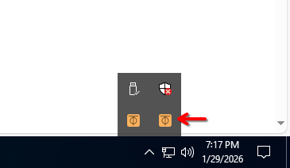
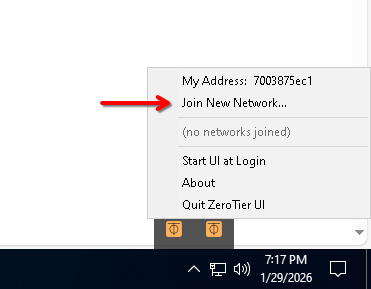
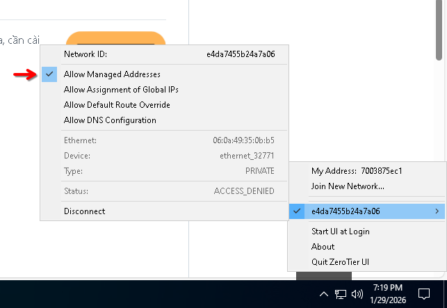

# Trang hỗ trợ server

| Phiên bản Minecraft           | Địa chỉ                       | 
| :----------------- | :----------------------------- |
| `1.21.8 Vanilla`   | `192.168.196.32:25566`                         |

> Đây là trang hỗ trợ cho server ngcm(nigachoimine), hãy xem mục lục ở bên dưới

## Mục lục
- [Cách truy cập vào server](#cách-truy-cập-vào-server)
- [Các mod và datapack\(kèm các mod yêu cầu cài ở client để hoạt động\)](#tài-nguyên-server)
## Cách truy cập vào server
<a href="https://zerotier.com"></a>
> Server này sử dụng zerotier làm VPN để các máy khách có thể truy cập được từ xa, cần cài và yêu cầu tham gia mạng nội bộ của Zerotier

- Bước 1: Tải Zerotier [tại đây](https://www.zerotier.com/download/)
- Bước 2: Tìm biểu tượng Zerotier trên taskbar, nhấn chọn **Join New Network**

<p align="center">
  
</p>

- Bước 3: Nhập ID mạng Zerotier sau: **`e4da7455b24a7a06`** và nhấn **Join**

<p align="center">
  
</p>

- Bước 4: Đảm bảo bạn đã tích chọn **Allow managed addresses**

<p align="center">
  
</p>

- Bước 5: Liên hệ với admin để phê duyệt thiết bị của bạn

Sau khi kết nối, bạn có thể truy cập server ở địa chỉ sau: 

```192.168.196.32:25566```

## Tài nguyên server
### Các mod trong server: (modloader: Fabric)
chú thích: dấu * là các mod cần cài từ client để có thể hoạt động đầy đủ, nhưng không bắt buộc để có thể chơi server này, nhấn vào sẽ dẫn tới link tải
- *[ RoughlyEnoughItems-20.0.811-fabric.jar ](https://modrinth.com/mod/rei)
- [ ScalableLux-0.1.5.1+fabric.abdeefa-all.jar ](https://modrinth.com/mod/scalablelux)
- [ anvilrestoration-1.21.8-2.4.jar ](https://modrinth.com/mod/anvil-restoration)
- *[ appleskin-fabric-mc1.21.6-3.0.6.jar ](https://modrinth.com/mod/appleskin)
- [ architectury-17.0.8-fabric.jar ](https://modrinth.com/mod/architectury-api)
- *[ armored-elytra-1.9.0.jar ](https://modrinth.com/datapack/elytra-armor)
- [ better-fabric-console-mc1.21.8-1.2.5.jar ](https://modrinth.com/mod/better-fabric-console)
- [ c2me-fabric-mc1.21.8-0.3.4.0.0.jar ](https://modrinth.com/mod/c2me-fabric)
- [ collective-1.21.8-8.10.jar ](https://modrinth.com/mod/collective)
- [ enchantments-encore-3.2.1.jar ](https://modrinth.com/datapack/enchantments-encore)
- [ fabric-api-0.134.0+1.21.8.jar ](https://modrinth.com/mod/fabric-api)
- [ ferritecore-8.0.0-fabric.jar ](https://modrinth.com/mod/ferrite-core)
- [ giantspawn-1.21.8-5.3.jar ](https://modrinth.com/mod/giant-spawn)
- [ inventorytotem-1.21.8-3.4 (1).jar' ](https://modrinth.com/mod/inventory-totem)
- [ krypton-0.2.9.jar ](https://modrinth.com/mod/krypton)
- [ lithium-fabric-0.18.1+mc1.21.8.jar ](https://modrinth.com/mod/lithium)
- [ noisium-fabric-2.7.0+mc1.21.6.jar ](https://modrinth.com/mod/noisium)
- [ servux-fabric-1.21.8-0.7.3.jar ](https://modrinth.com/mod/servux)
- [ threadtweak-fabric-0.1.7+mc1.21.5.jar ](https://modrinth.com/mod/threadtweak)
- *[ trade-cycling-fabric-1.21.8-1.0.19.jar ](https://modrinth.com/mod/trade-cycling) 
- *[voicechat-fabric-1.21.8-2.6.6.jar](https://modrinth.com/plugin/simple-voice-chat)
- [ easyauth-mc1.21.6-3.3.6.jar ](https://modrinth.com/mod/easyauth)
- [NE-1.21.8-1.10.2.jar\(No expensive\)](https://modrinth.com/mod/noexpensive)


### Các datapack 
- [ 'DnT Ancient City Overhaul v3.1' ](https://modrinth.com/datapack/dungeons-and-taverns-ancient-city-overhaul)
- [ 'DnT Desert Temple Overhaul v2.zip' ](https://modrinth.com/datapack/dungeons-and-taverns-desert-temple-overhaul)
- [ 'DnT End Castle Standalone v1.3.4.zip' ](https://modrinth.com/datapack/dungeons-and-taverns-end-castle-standalone)
- [ 'DnT Nether Fortress Overhaul v3.zip' ](https://modrinth.com/datapack/dungeons-and-taverns-nether-fortress-overhaul)
- [ 'DnT Ocean Monument Overhaul v2.zip' ](https://modrinth.com/datapack/dungeons-and-taverns-ocean-monument-overhaul)
- [ 'DnT Pillager Outpost Overhaul v3.2.1.zip' ](https://modrinth.com/datapack/dungeons-and-taverns-pillager-outpost-overhaul)
- [ 'DnT Stronghold Overhaul v2.3.1' ](https://modrinth.com/datapack/dungeons-and-taverns-stronghold-overhaul)
- [ 'DnT Swamp Hut Overhaul v2.2.zip' ](https://modrinth.com/datapack/dungeons-and-taverns-swamp-hut-overhaul)
- [ 'DnT Woodland Mansion Replacement v1.6.1.zip' ](https://modrinth.com/datapack/dungeons-and-taverns-woodland-mansion-overhaul)
- [  Incendium_1.21.5_v5.4.8_UNSUPPORTED ](https://modrinth.com/datapack/incendium)
- [ 'Last Death Location - 2.0.4.zip' ](https://modrinth.com/datapack/last-death-location)
- [  Nullscape_1.21_v1.2.13 ](https://modrinth.com/datapack/nullscape)
- [  Structory_1.21_v1.3.11 ](https://modrinth.com/datapack/structory)
- [  Structory_Towers_1.21_v1.0.13 ](https://modrinth.com/datapack/structory-towers)
- [  Terralith_1.21.5_v2.5.11 ](https://modrinth.com/datapack/terralith)
- [  Veinminer-Enchantment-1.2.3.zip ](https://modrinth.com/datapack/veinminer-enchantment)
- [  banner-bedsheets-v1-8.zip ](https://modrinth.com/datapack/banner-bedsheets)
- [  banner-flags-v2-9.zip ](https://modrinth.com/datapack/banner-flags)
- [  biomesaplings-v1.1.6.zip ](https://modrinth.com/datapack/terralith-biome-saplings)
- [  mine-treasure-1.6.zip ](https://modrinth.com/datapack/mine-treasure)
- [  more_mobs-v1.5.7-mc1.14-1.21.9-datapack.zip ](https://modrinth.com/datapack/more-mobs)
- [  terratonic-3.0.0-datapack ](https://modrinth.com/datapack/terratonic)
- [  upgraded-mobs-1.5.0 ](https://modrinth.com/datapack/upgraded-mobs)
- [  vanilla-refresh-1.4.28 ](https://modrinth.com/datapack/vanilla-refresh)
- [  veinminer-1.3.2.zip ](https://modrinth.com/datapack/veinminer)
- [ \'xp bottling v1.1.15 \(MC 1.21-1.21.9\).zip\' \(vanilla tweaks\) ](https://vanillatweaks.net/share#7v0zGS)
- [ 'zDungeons and Taverns v4.7.3' ](https://modrinth.com/datapack/dungeons-and-taverns)

