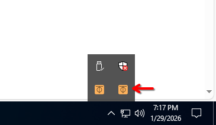
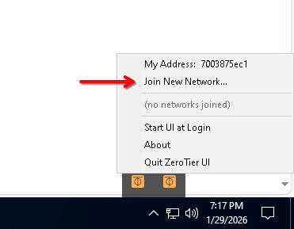
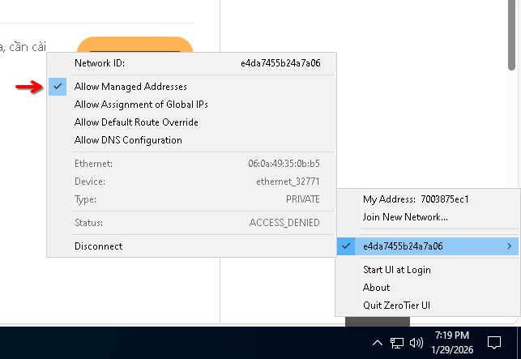

# Trang hỗ trợ server

| Phiên bản Minecraft           | Địa chỉ                       | 
| :----------------- | :----------------------------- |
| `1.21.8 Vanilla`   | `192.168.196.32:25566`                         |

> Đây là trang hỗ trợ cho server ngcm(nigachoimine), hãy xem mục lục ở bên dưới

## Mục lục
- [Cách truy cập vào server](#cách-truy-cập-vào-server)
- [Các mod và datapack\(kèm các mod yêu cầu cài ở client để hoạt động\)](#tài-nguyên-server)
## Cách truy cập vào server
<a href="https://zerotier.com"></a>
> Server này sử dụng zerotier làm VPN để các máy khách có thể truy cập được từ xa, cần cài và yêu cầu tham gia mạng nội bộ của Zerotier

### **\*Nếu bạn đã có vpn rồi, có thể bỏ qua bước này và kết nối thẳng đến địa chỉ server đã được để ở đầu trang**

- **Bước 1:** Tải Zerotier [tại đây](https://www.zerotier.com/download/)
- **Bước 2:** Tìm biểu tượng Zerotier trên taskbar, nhấn chọn **Join New Network**

<p align="center">
  
</p>

- **Bước 3:** Nhập ID mạng Zerotier sau: **`e4da7455b24a7a06`** và nhấn **Join**

<p align="center">
  
</p>

- **Bước 4:** Đảm bảo bạn đã tích chọn **Allow managed addresses**

<p align="center">
  
</p>

- **Bước 5:** Liên hệ với admin để phê duyệt thiết bị của bạn

Sau khi kết nối, bạn có thể truy cập server ở **địa chỉ sau**: 

```192.168.196.32:25566```

## Tài nguyên server
### Các mod trong server: (modloader: Fabric)
chú thích: dấu * là các mod cần cài từ client để có thể hoạt động đầy đủ, nhưng không bắt buộc để có thể chơi server này, nhấn vào sẽ dẫn tới link tải
- [Anvil Restoration](https://modrinth.com/mod/anvil-restoration)
- *[AppleSkin](https://modrinth.com/mod/appleskin) 
    <details closed>
        <summary>Xem thêm</summary>
        <ul>
            <li> - Khi **không cài**: không hiện thanh bão hoà, chơi game bình thường </li>
            <li> - Khi **có cài**: thanh đói hiện thêm độ bão hoà, lượng máu và thức ăn hồi được khi cầm vật phẩm </li>
        </ul>
    </details

- [Architectury API](https://modrinth.com/mod/architectury-api)
- [Better Fabric Console](https://modrinth.com/mod/better-fabric-console)
- [Concurrent Chunk Management Engine (Fabric)](https://modrinth.com/mod/c2me-fabric)
- *[Carpet](https://modrinth.com/mod/carpet)
    <details closed>
        <summary>Xem thêm</summary>
        <ul>
            <li> - Khi **không cài**:chơi game bình thường </li>
            <li> - Khi **có cài**: sử dụng được các lệnh của carpet</li>
        </ul>
    </details
- [Cloth Config API](https://modrinth.com/mod/cloth-config)
- [Collective](https://modrinth.com/mod/collective)
- [EasyAuth](https://modrinth.com/mod/easyauth)
- *[Armored Elytra](https://modrinth.com/mod/elytra-armor)
    <details closed>
        <summary>Xem thêm</summary>
        <ul>
            <li> - Khi **không cài**: không hiện elytra trên model người chơi, chơi game bình thường, chế tạo và bay bằng giáp elytra bình thường </li>
            <li> - Khi **có cài**: hiện được elytra trên model người chơi</li>
        </ul>
    </details
- [Enchantments Encore](https://modrinth.com/mod/enchantments-encore)
- [Fabric API](https://modrinth.com/mod/fabric-api)
- [FerriteCore](https://modrinth.com/mod/ferrite-core)
- [Giant Spawn](https://modrinth.com/mod/giant-spawn)
- [Inventory Totem](https://modrinth.com/mod/inventory-totem)
- [Krypton](https://modrinth.com/mod/krypton)
- [Lithium](https://modrinth.com/mod/lithium)
- [Noisium](https://modrinth.com/mod/noisium)
- *[Roughly Enough Items (REI)](https://modrinth.com/mod/rei)
    <details closed>
        <summary>Xem thêm</summary>
        <ul>
            <li> - Khi **không cài**: chơi game bình thường </li>
            <li> - Khi **có cài**: thêm các tính năng của mod REI</li>
        </ul>
    </details
- [ScalableLux](https://modrinth.com/mod/scalablelux)
- [Servux](https://modrinth.com/mod/servux)
- *[Simple Voice Chat](https://modrinth.com/mod/simple-voice-chat)
    <details closed>
        <summary>Xem thêm</summary>
        <ul>
            <li> - Khi **không cài**: chơi game bình thường, nhưng không chat giọng nói được </li>
            <li> - Khi **có cài**: có thể chat giọng nói </li>
        </ul>
    </details
- [ThreadTweak](https://modrinth.com/mod/threadtweak)
- *[Trade Cycling](https://modrinth.com/mod/trade-cycling)
    <details closed>
        <summary>Xem thêm</summary>
        <ul>
            <li> - Khi **không cài**: chơi game bình thường, trong menu trade không có nút để reset vật phẩm trao đổi của dân làng </li>
            <li> - Khi **có cài**: menu trade hiện thêm nút reset cho phép đổi trade của dân làng mà không cần đập khối nghề</li>
        </ul>
    </details


### Các datapack 
- [Banner Bedsheets](https://modrinth.com/mod/banner-bedsheets)
- [Banner Flags](https://modrinth.com/mod/banner-flags)
- [Dungeons and Taverns Ancient City Overhaul](https://modrinth.com/mod/dungeons-and-taverns-ancient-city-overhaul)
- [Dungeons and Taverns Desert Temple Overhaul](https://modrinth.com/mod/dungeons-and-taverns-desert-temple-overhaul)
- [[Retired] Dungeons and Taverns End Castle Standalone](https://modrinth.com/mod/dungeons-and-taverns-end-castle-standalone)
- [Dungeons and Taverns Nether Fortress Overhaul](https://modrinth.com/mod/dungeons-and-taverns-nether-fortress-overhaul)
- [Dungeons and Taverns Ocean Monument Overhaul](https://modrinth.com/mod/dungeons-and-taverns-ocean-monument-overhaul)
- [Dungeons and Taverns Pillager Outpost Overhaul](https://modrinth.com/mod/dungeons-and-taverns-pillager-outpost-overhaul)
- [Dungeons and Taverns](https://modrinth.com/mod/dungeons-and-taverns)
- [Dungeons and Taverns Stronghold Overhaul](https://modrinth.com/mod/dungeons-and-taverns-stronghold-overhaul)
- [Dungeons and Taverns Swamp Hut Overhaul](https://modrinth.com/mod/dungeons-and-taverns-swamp-hut-overhaul)
- [Dungeons and Taverns Woodland Mansion Overhaul](https://modrinth.com/mod/dungeons-and-taverns-woodland-mansion-overhaul)
- [Incendium](https://modrinth.com/mod/incendium)
- [Last Death Location](https://modrinth.com/mod/last-death-location)
- [Mine Treasure](https://modrinth.com/mod/mine-treasure)
- [More Mobs](https://modrinth.com/mod/more-mobs)
- [Nullscape](https://modrinth.com/mod/nullscape)
- [Structory](https://modrinth.com/mod/structory)
- [Structory: Towers](https://modrinth.com/mod/structory-towers)
- [Custom Biome Saplings](https://modrinth.com/mod/terralith-biome-saplings)
- [Terralith](https://modrinth.com/mod/terralith)
- [Terratonic](https://modrinth.com/mod/terratonic)
- [Vanilla Refresh](https://modrinth.com/mod/vanilla-refresh)
- [Veinminer Enchantment](https://modrinth.com/mod/veinminer-enchantment)
- [Veinminer](https://modrinth.com/mod/veinminer)
##### Datapack đã được chỉnh sửa
- Upgraded Mobs ( [link datapack gốc]( https://modrinth.com/datapack/upgraded-mobs ) | [link datapack đã đc chỉnh sửa \(nerf quái cho bớt khó\)](packwiz/datapacks/datapacks/upgraded-mobs-1.5.0.zip) )
##### Lưu ý: dưới đây là các datapack vanila tweaks, nhấn vào [đây](https://vanillatweaks.net/share#SeGjwV) để tải các datapack này xuống
- redstone rotation wrench v1.1.16 (MC 1.21-1.21.11).zip
- spawning spheres v1.1.15 (MC 1.21-1.21.11).zip
- wandering trader announcements v1.0.8 (MC 1.21-1.21.11).zip
- xp bottling v1.1.16 (MC 1.21-1.21.11).zip
